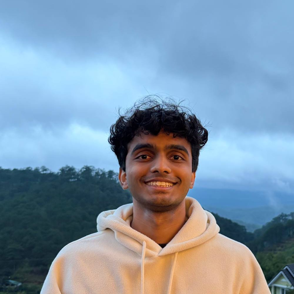
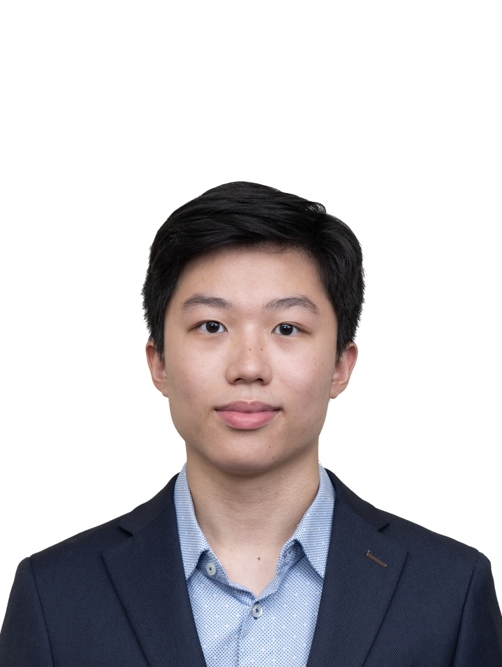
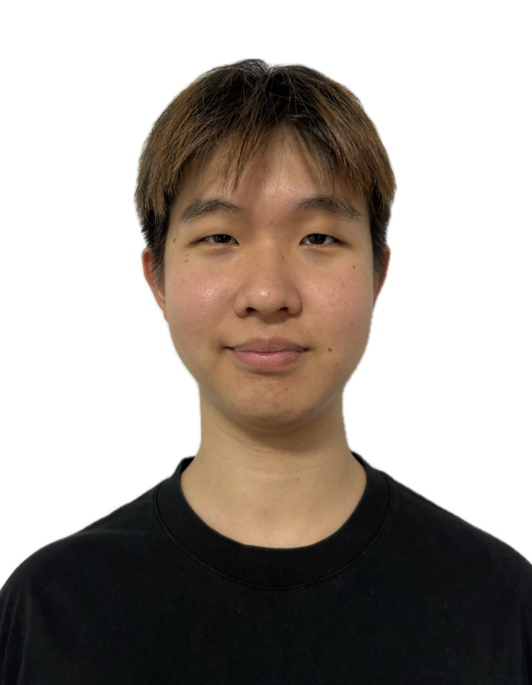
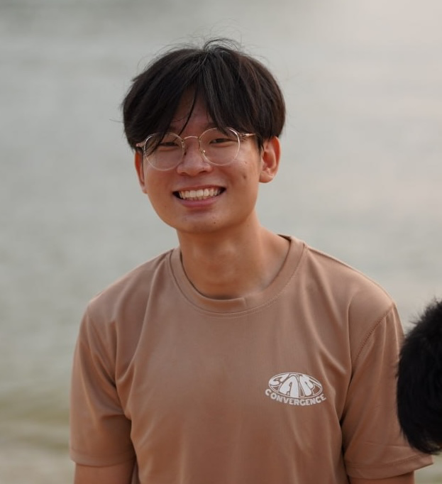

We are a team based in the [School of Computing, National University of Singapore](https://www.comp.nus.edu.sg).

You can reach us at the email `seer[at]comp.nus.edu.sg`

## Project team

### Pavan Madhu

[[github](https://github.com/pavan2184)]

* Role: Team Lead
* Responsibilities: Overall project coordination

### Evan Ng

[[github](https://github.com/EvanNg213)]

* Role: Developer
* Responsibilities: Deliverables and Deadlines

### Nix Koh

[[github](https://github.com/nyxkk)]

* Role: Developer
* Responsibilities: Testing

### Jean Doe

[[github](http://github.com/johndoe)]
[[portfolio](team/johndoe.md)]

* Role: Developer
* Responsibilities: Dev Ops + Threading

### Ethan

[[github](https://github.com/ewje)]

* Role: Code Quality
* Responsibilities: Looks after code quality and ensures adherence to coding standards
