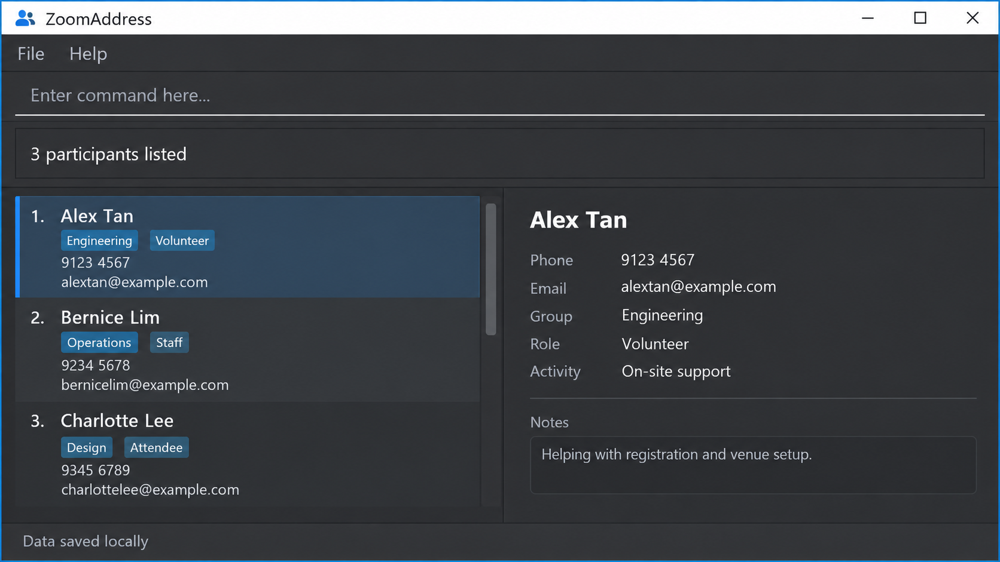

**ZoomAddress is a desktop participant-management application for directors of large-scale computing events.** It
keeps participant information and assignments to groups, roles, and activities in one local directory. Its
keyboard-driven command interface helps experienced users retrieve and update records quickly.

* To start using ZoomAddress, see the [_Quick Start_ section of the **User Guide**](UserGuide.html#quick-start).
* To contribute to ZoomAddress, see the [**Developer Guide**](DeveloperGuide.html).
* To learn about the project team, see [**About Us**](AboutUs.html).
* To view the source code, visit the [**team repository**](https://github.com/AY2627S1-CS2103T-W13-2/tp).

**Acknowledgements**

ZoomAddress is based on the
[AddressBook-Level3 project](https://github.com/se-edu/addressbook-level3) created by the
[SE-EDU initiative](https://se-education.org/).
